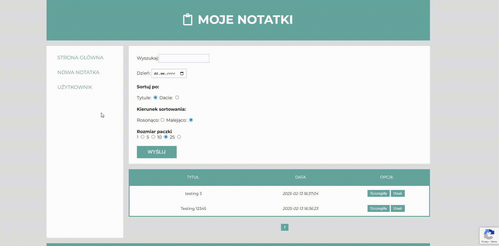
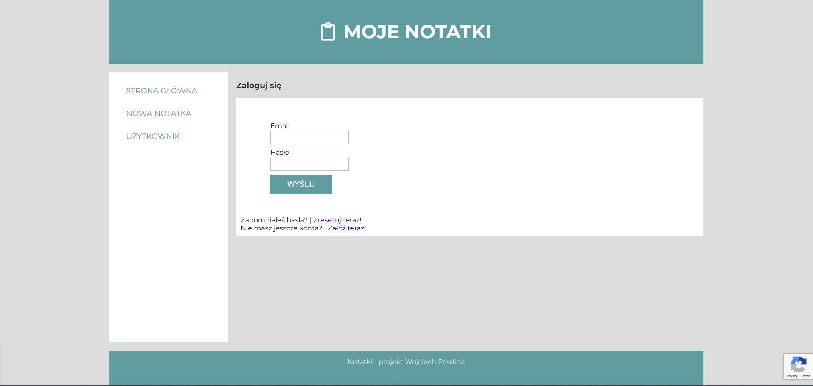
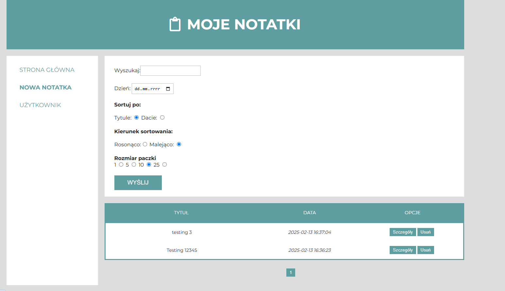
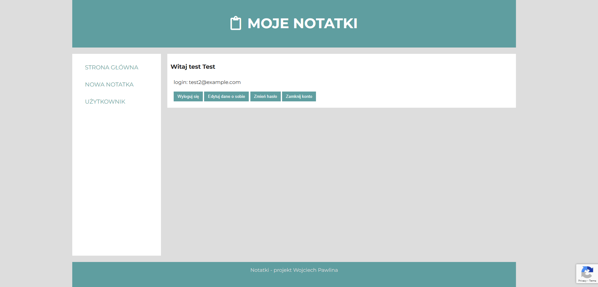

<h1>Notatki.pl<h1>

<h2>Overview</h2>
Notatki.pl is an online application that allows users to create, edit, and manage notes stored on a server and accessible from anywhere via the internet. After registering an account, users can securely create, modify, and delete their personal notes, ensuring they always have access to their data. The application is built in PHP without the use of frameworks, following the MVC architecture and a monolithic structure, ensuring simplicity, stability, and ease of maintenance.

<h2>Technologies</h2>
<ul>
  <li>Backend: PHP, MySql, Mailpit</li>
  <li>Frontend: HTML, CSS, JavaScript</li>
  <li>Development Enviroment: PHPStorm, Visual Studio Code</li>
</ul>

<h2>Setup</h2>
<h4>Clone repository</h4>
git clone https://github.com/Wpawlina/Notatki.pl.git

<h4>Start Docker</h4>
cd Notatki.pl 
docker compose up -d
 
 

Proceed to http://127.0.0.1:8081/ and create an account.

For PhpMyAdmin proceed to http://127.0.0.1:8080/ and login as root with password Qwerty12345

For Mailpit proceed to http://127.0.0.1:8025/

